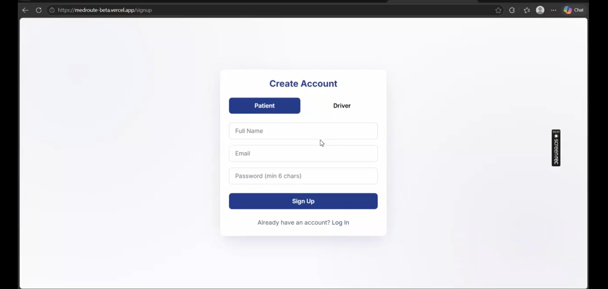
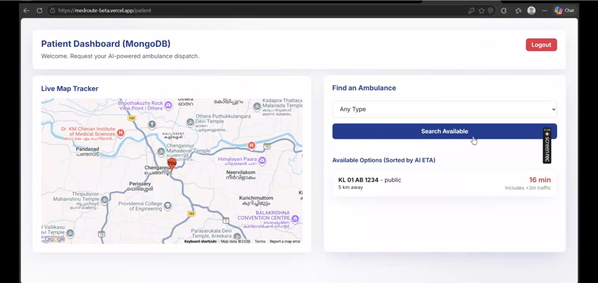
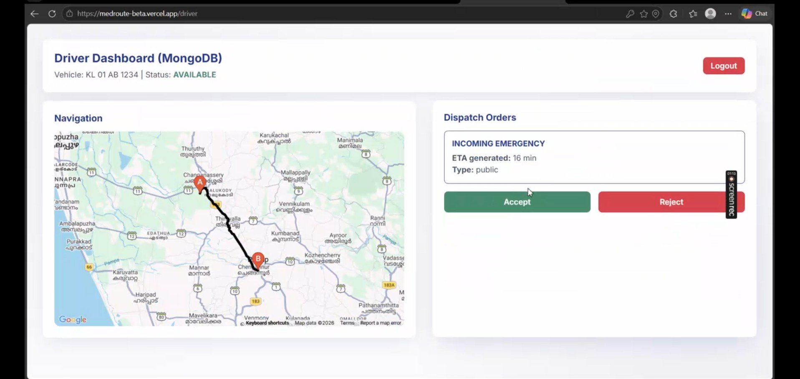
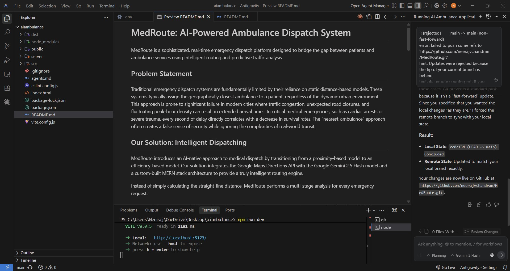

# MedRoute: AI-Powered Ambulance Dispatch System

MedRoute is a sophisticated, real-time emergency dispatch platform designed to bridge the gap between patients and ambulance services using intelligent routing and predictive traffic analysis.

## Application Demo

[Watch the Demo Video](https://github.com/neerajvchandran/MedRoute/raw/main/media/hostednew.mp4)


## Problem Statement

Traditional emergency dispatch systems are fundamentally limited by their reliance on static distance-based models. These systems typically assign the geographically closest ambulance to a patient, regardless of the dynamic urban environment. This approach is prone to significant failure in modern cities where traffic congestion, unexpected road closures, and fluctuating peak-hour density can result in extended arrival times. In critical medical emergencies—such as cardiac arrests or severe trauma—every second of delay directly correlates with a decrease in survival rates. The "nearest-ambulance" approach often creates a false sense of security while ignoring the complexities of real-world transit.

## Application Screenshots






## Our Solution: Intelligent Dispatching

MedRoute introduces an AI-native approach to medical dispatch by transitioning from a proximity-based model to an efficiency-based model. Our solution integrates the Google Maps Directions API with the Google Gemini 2.5 Flash model and a custom-built MERN stack architecture to provide a truly intelligent routing engine.

Instead of simply calculating the straight-line distance, MedRoute performs a multi-stage analysis for every emergency request:

1. **Real-Time Data Acquisition**: Utilizing the Google Maps Directions Service, the system identifies all available drivers and fetches real-time traffic-aware routes.
2. **Predictive AI Reasoning**: The raw Google Maps data is passed to the Gemini AI model, which evaluates the current time of day, historical traffic patterns for the specific route, and environmental conditions. This produces a "Predicted Delay" factor that accounts for future congestion that may arise during the trip.
3. **Smart Sorting and Dispatch**: The system combines the Google base ETA with the AI-predicted delay and a small dynamic variance for realism. Drivers are then sorted by the final intelligent ETA, ensuring the user is presented with the absolute fastest option currently available on the network.

This data-driven approach minimizes human error in dispatching and guarantees that the selected ambulance is the one most likely to arrive on the scene in the shortest possible time.

## Technical Disclaimer: Prototype vs. Production

It is important to note that MedRoute is currently a functional prototype and proof-of-concept. While the system demonstrates a high level of integration between AI and real-time mapping, several key differences would be implemented in a full-scale production environment:

- **Historical Data Acquisition**: A production-ready model would require the acquisition of large-scale historical traffic datasets. This would allow the system to predict current traffic patterns with statistical precision rather than relying purely on LLM-based reasoning.
- **Enhanced Calculation Engine**: In a real-world scenario, the time calculation would be refined using the formula `Total Time = (Distance / Average Speed) + Dynamic Traffic Latency`. The "Dynamic Traffic Latency" factor would be derived from multi-layered real-time sensor data and historical congestion logs.
- **AI Integration**: In this prototype, Google Gemini is utilized as an intelligent reasoning engine to simulate the logic of a predictive traffic model. For a production release, this would be replaced or supplemented by a dedicated, fine-tuned machine learning model trained specifically on local urban transit data to minimize the margin of error.

## Future Roadmap & Production Scalability

To transition from a prototype to a mission-critical emergency system, the following development paths will be implemented:

### 1. Advanced Traffic Data Pipeline (Historical & Predictive)
- **Deep Historical Ingestion**: Moving beyond real-time snapshots to a multi-layered data lake. This involves ingesting "Previous Day" and "Comparative Day" (e.g., same Tuesday last year) traffic metadata from the **Google Maps Historical Traffic API**. This establishes a seasonal and daily baseline for urban transit.
- **Predictive AI Modeling**: Transitioning from LLM reasoning to a **Temporal Fusion Transformer (TFT)** or **LSTM** network. By training on previous day traffic flows, the AI can predict future "Ghost Jams" or recurring congestion patterns (e.g., school dismissals or stadium event exits) before they appear on the live map.

### 2. Dynamic Incident & Autonomous Rerouting
- **Multi-Source Incident Sensing**: Integrating real-time feeds from Waze, local police dispatch (CAD), and city-wide CCTV (via Computer Vision) to identify road blockages, accidents, or weather-induced hazards within seconds.
- **Recursive Navigation Logic**: In the event of a blockage, the system triggers an asynchronous recalculation of all active routes. This ensures the driver is never routed toward a dead-end or high-latency zone.
- **Decision Logging & Analytics**: Every rerouting decision is logged as a training sample. By storing the "Reroute Success Rate" (Actual Time vs. Predicted Reroute Time), the system autonomously learns which alternative "shortcuts" are actually viable for emergency vehicles.

### 3. Continuous Learning Loop (Reinforcement Learning)
- **The Ground-Truth Comparator**: A persistent service that compares `InitialETA` with `ActualTimeAtArrival`. Any delta larger than 10% triggers an automated "Incident Report" for the AI to analyze why the prediction failed.
- **Model Re-Training**: The model is re-weighted nightly using the previous 24 hours of dispatch data, ensuring the system adapts to seasonal changes, new construction, or shifts in urban density.

### 4. Smart City & V2X Integration
- **V2X (Vehicle-to-Everything)**: Implementing communication protocols between the ambulance and the city's traffic management system. This enables **Emergency Vehicle Preemption (EVP)**, where traffic lights are automatically cleared for the approaching ambulance.
- **Smart Intersections**: Using IoT sensors at major junctions to provide the ambulance with a "Clearance Confidence Score" before it even reaches the light.

### 5. Predictive Dispatching (Pre-Positioning)
- **Emergency Heatmaps**: Using K-means clustering and time-series analysis on historical "Call Out" data to identify high-risk zones by time of day.
- **Proactive Staging**: Instead of waiting at a station, ambulances are "pre-positioned" in areas with a statistically high probability of an emergency (e.g., near high-traffic highway interchanges during rush hour).

---

## Core Features

- **Smart Dispatch Logic**: Automates the selection of available ambulances based on the lowest calculated ETA, incorporating both real-time Google Maps data and AI-based traffic reasoning.
- **Dual-Role Accounts**: Users can hold both Patient and Driver roles on a single account, with the ability to switch between modes during the login process.
- **Real-Time Map Integration**: Full Google Maps support with live route tracing for drivers and live tracking for patients.
- **Predictive AI Reasoning**: Uses Google Gemini AI to analyze environmental factors (time of day, traffic levels, route types) to predict dynamic delays and offer more accurate arrival times.
- **Custom Authentication**: Secure JWT-based authentication system with password hashing, replacing standard serverless solutions for greater flexibility and control.

## Developed with Antigravity AI

MedRoute was architected and developed with the assistance of **Antigravity AI**, a powerful agentic AI coding assistant from Google Deepmind.




## Technology Stack

- **Frontend**: React.js 19, Vite, React Router DOM 7, Vanilla CSS3 (Glassmorphism design).
- **Backend**: Node.js, Express.js.
- **Database**: MongoDB Atlas (NoSQL) with Mongoose ODM.
- **APIs**: 
    - Google Maps JavaScript API (Map Rendering)
    - Google Maps Directions API (Route Calculation)
    - Google Gemini AI 2.5 Flash (Traffic Prediction)

## Project Structure

- **root/**: Contains the React frontend and project configuration.
- **server/**: Contains the Node.js/Express backend server, Mongoose models, and API routes.

## Local Setup Instructions

1. **Clone the repository**:
   ```bash
   git clone [repository-url]
   ```

2. **Install dependencies**:
   - For frontend: `npm install`
   - For backend: `cd server && npm install`

3. **Environment Configuration**:
   Create a `.env` file in the root directory with the following keys:
   - `VITE_GOOGLE_MAPS_API_KEY`
   - `VITE_GEMINI_API_KEY`
   - `VITE_API_URL=http://localhost:5000`
   - `MONGO_URI`
   - `JWT_SECRET`

4. **Run the application**:
   - Start backend: `cd server && node server.js`
   - Start frontend: `npm run dev`

## Deployment Strategy

The application is architected for split-hosting environments to ensure optimal performance and scalability:
- **Frontend**: Hosted on Vercel for fast static delivery and Edge network performance.
- **Backend**: Hosted on Render to manage persistent database connections and backend logic.

## Security Notice

The `.env` file is excluded from version control via `.gitignore`. In a production environment, all environment variables must be manually configured in the project settings of the respective hosting providers (Vercel for frontend keys, Render for backend keys).